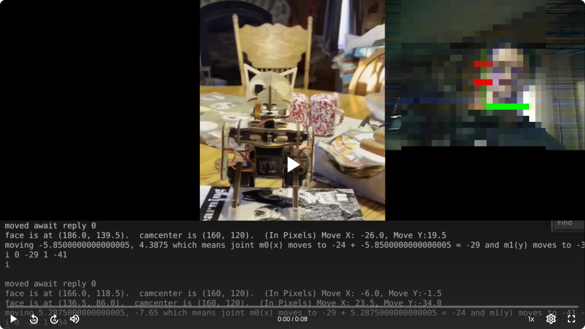

# Nybble Face Tracking Project

## Overview

This project was the result of a lot of trial and error with different hardware/software/embedded system combinations.  The goal was to add a battery efficient face tracking to Petoi's Nybble.  The project stopped at achieving this on a basic level.

It utilizes both the ESP32-CAM and it's wifi capability as well as Nybble's Bluetooth capability and uses a laptop to do the actual facetracking calculations.  The laptop receives the ESP-32 video feed streaming over wifi.  It then uses python and OpenCV's deep learning based face detectiong modules to track a  face in real time.  This information is then translated via python to servo serial commands over bluetooth.  The end result is Nybble follows your face!  Unfortunately no embedded system in all my testing had satisfactory face detection for a good price point and also for good battery life for Nybble.  As AI embedded systems become stronger, I'm sure this intermediate step of having a laptop can be eventually phased out, while still getting a very battery efficient, low cost embedded chip.  However I believe this is a meaningful and novel approach to get robust face tracking on a small hobby robot.

[](https://streamable.com/m27e71)

## Features

- **Real-Time Face Detection**: Utilizes OpenCV's DNN (Deep Neural Network) module with a pre-trained SSD (Single Shot Multibox Detector) model for fast and accurate face detection.
- **Dynamic Servo Control**: Automatically adjusts servo motors to align the camera with detected faces, keeping the face centered in the frame.  It also minimizes wasted movements by moving accurately and only moving if the face is outside of a configurable threshold.
- **WiFi and Serial Communication**: Utilizes WiFi streaming from an ESP32-CAM module and serial communication over Bluetooth to control Nybble's movement.
- **Configurable Parameters**: Offers dynamic adjustment of various parameters such as detection thresholds, camera resolution, servo movement delays, and more.
- **Robust Error Handling**: Built-in error handling and resource management ensure smooth operation and minimize system crashes.

## How It Works

1. **Video Streaming**: The ESP32-CAM module streams video over a local WiFi network. This stream is captured using OpenCV's `VideoCapture` functionality.

2. **Face Detection**: The captured frames are processed using a pre-trained face detection model (`res10_300x300_ssd_iter_140000_fp16.caffemodel`) from OpenCV's DNN module. The model identifies the coordinates of faces within the frame.

3. **Calculating Movements**: The system calculates the difference between the center of the detected face and the center of the camera's field of view. Based on this difference, the program calculates the required movements in degrees.

4. **Servo Control**: The calculated movements are translated into servo motor commands. These commands are sent via serial communication (Bluetooth) to the Nybble robot, adjusting its head's position to keep the face centered in view.

5. **Dynamic Adjustment and Calibration**: The system allows for on-the-fly adjustments to detection thresholds, movement delays, and other settings, making it adaptable to various environments and conditions.

## Approach to The Problem

This project aimed to solve this problem in a way that isn't intensive on the battery and is also affordable.

- **Integration of Affordable Components**: By combining an inexpensive ESP32-CAM module with the Nybble robot, the project demonstrates that advanced face-tracking capabilities can be achieved using affordable hardware. This makes it accessible to hobbyists, educators, and researchers who may not have access to high-end equipment.

- **Using a Laptop For Expensive Calculations**: By using a laptop as the in between device, Nybble can stay light weight and stay using low cost components and have a long battery life without sacrificing any of the power or accuracy of the face detection.

- **Real-Time Feedback Loop**: The system provides a real-time feedback loop where detected face positions are immediately used to adjust the robot's orientation. This creates a highly responsive interaction, essential for applications in human-robot interaction and robotics education.

- **Flexible and Configurable Design**: The project allows users to adjust various parameters dynamically, including face detection thresholds, camera settings, and servo movement sensitivity. This flexibility makes the system robust across different lighting conditions, distances, and environments.

- **Modular and Extensible Codebase**: The code is organized into modular functions and separated into logical components (e.g., camera setup, face detection, servo control), making it easy to extend and adapt for future improvements or different use cases.

- **Simplicity**: I tried using more complex libraries and tool kits even that came with Nybble that are feature rich.  However I kept having hang ups or things would behave a bit differently than I wanted, and I always appreciate a nice stripped down, optimized to only the necessary parts codebase to maintain and debug.

## Getting Started

### Prerequisites

- **Python 3.x**: The code is written in Python and requires Python 3.x to run.
- **OpenCV**: Install OpenCV for Python (`cv2` module) to handle video capture and face detection.
- **PySerial**: Required for serial communication with the Nybble robot over Bluetooth.
- **ESP32-CAM**: A camera module that streams video over WiFi.
- **Nybble Robot**: A small, programmable robot that can be controlled via Bluetooth.  You can obtain it and construct it from (here)[https://www.petoi.com/products/petoi-nybble-robot-cat]

### Installation

1. **Clone the Repository**:  
   ```bash
   git clone https://github.com/minerva-ds/nybble-face-tracking.git
   cd nybble-face-tracking
   ```

2. **Install Python Dependencies**:  
   ```bash
   pip install opencv-python pyserial requests
   ```

3. **Download Face Detection Model**:  
   Download the model and prototxt file from the [Face Detection Comparison GitHub](https://github.com/spmallick/learnopencv/tree/master/FaceDetectionComparison/models) and place them in the `models` directory.

### Usage

1. **Connect to the ESP32-CAM**: Ensure you have setup the ESP32-CAM to stream from its own WiFi and make sure your laptop is connected to it.

2. **Connect to Nybble**: Make sure you have connected to Nybble over bluetooth.  For linux I have the `bind_rfcomm0.sh` script which should make it very easy, simply run it.

3. **Run the Script**:  
   ```bash
   python nybble_face_tracking.py
   ```

4. **Controls**:  
   - **Press 'd'**: Toggle face detection on/off.
   - **Press 'q'**: Quit the application.

### Configuration

Edit the `variables.py` file to adjust settings like camera resolution, face detection thresholds, servo control parameters, and more.

## Contributing

Contributions are welcome! Please fork the repository and submit a pull request with your improvements. Whether it's optimizing the code, adding new features, or improving documentation, your help is appreciated.

## License

This project is licensed under the MIT License. See the [LICENSE](LICENSE) file for more details.

## Acknowledgments

- OpenCV and its contributors for providing an extensive computer vision library.
- The [LearnOpenCV](https://github.com/spmallick/learnopencv) project for the pre-trained face detection models.
- Nybble and the OpenCat community for creating an accessible, programmable robot platform.